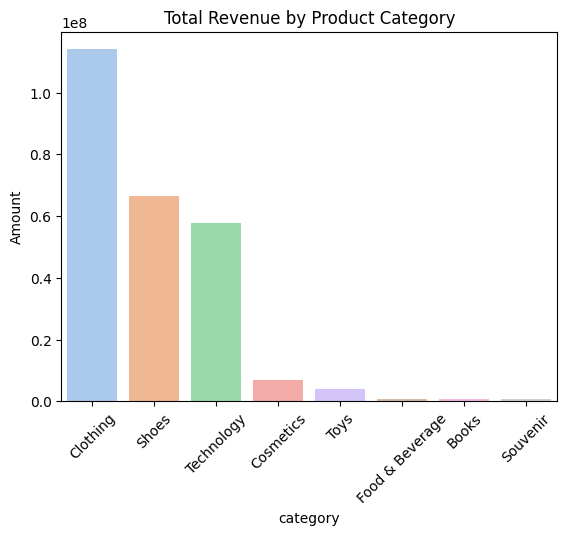
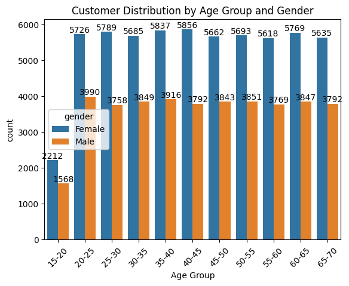

# 🛍️ Sales Analysis — Business Insights & Market Trends  

## 📌 Executive Summary  

This project analyzes customer shopping data to uncover **revenue drivers, consumer behavior, and product trends**.  

**Key Findings:**  
- 👗 Clothing generates the highest revenue, followed by **Shoes** and **Technology**.  
- 👩 Females spend more than males, with higher transaction counts.  
- 🎯 Customers aged **35–40** contribute the most revenue, while teenagers spend less.  
- 🏬 Shopping malls & payment methods strongly influence revenue distribution.  

👉 These insights help business stakeholders optimize product mix, refine target segments, and improve marketing ROI.  

**Potential Impact:** +15–20% growth in revenue by targeting **female customers (35–40 age group)** with premium product offerings.  

## ❓ Business Problem  

My aim was simple: collect the messy mall data and answer the big questions that every retailer secretly worries about:
- Which categories drive the most sales & profit?  
- Which age and gender groups actually spend money (and which just window shop)?  
- How do seasonal and mall-based factors influence revenue? 

## ⚙️ Methodology  

1. **Data Collection** – Imported raw transaction-level sales data (CSV).  
2. **Data Cleaning & Wrangling** – Removed missing values, standardized formats.  
3. **Feature Engineering** – Created new fields (`Amount`, `Age Groups`, `Month-Year`).  
4. **Exploratory Data Analysis (EDA)** – Revenue trends, customer segmentation, correlation checks.  
5. **Visualization** – Bar charts, line graphs, category-wise comparisons.  
6. **Business Insights** – Interpreted results for decision-making.  

## 🛠️ Skills & Tools  

- **Python**: Pandas, NumPy, Matplotlib, Seaborn  
- **EDA & Feature Engineering**  
- **Business Analytics**: Revenue funnel, category analysis  

## 📊 Results & Business Recommendations  

- **Product Strategy** → Focus on Clothing & Shoes as primary revenue drivers.  
- **Customer Targeting** → Create loyalty programs and personalized offers for female shoppers in their late 30s, as they consistently spend more.  
- **Mall Partnerships** → Identify high-revenue malls for targeted promotions. 
- **Payment Optimization** → Encourage top-performing payment methods.

💡 *Businessholders can use these findings to refine product launches, loyalty programs, and targeted ads.*  

## 📊 Visual Insights

**What sells the most (Products):**  

  
    

  

**Who spends the most (Customers):**  

  
    

  

## 🚀 Next Steps  

- 📈 Build interactive dashboards in **Tableau/Power BI** for real-time monitoring.  
- 🔮 Integrate predictive analytics to forecast seasonal trends.  
- 💵 Expand analysis to profit margins (not just revenue).  
- 👥 Explore **personalized recommendations** using AI/ML to enhance customer engagement. 

